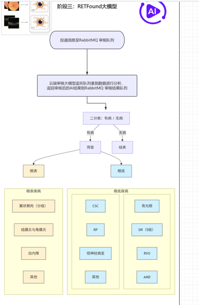

# 眼底图片疾病检测



这是一个关于眼底图片疾病检测模型的项目，基于 [RETFound_MAE](https://github.com/rmaphoh/RETFound_MAE) 的模型实现进行迁移学习和微调，以实现对眼底图片中疾病的检测和分类。

## 项目介绍

本项目利用深度学习技术，特别是基于MAE（Masked Autoencoder）的RETFound模型，对眼底图片进行疾病检测和分类。通过迁移学习和微调预训练模型，项目能够识别多种眼底疾病，包括AMD、CSC、DR、RP、RVO等。

## 项目结构

- `config`: 存放常用的命令行参数配置
- `data`: 存放数据集
- `diagnose_output`: 存放诊断结果输出文件
- `output`: 存放基于预训练模型微调得到的检查点
- `pretrain`: 存放预训练模型检查点
- `config.py`: 存放通用配置
- `diagnose.py`: 存放诊断脚本
- `finetune.py`: 存放微调脚本
- `mockClient.py`: 存放模拟实现的消息队列客户端
- `models_vit.py`: 存放RETFound_MAE模型实现
- `predict.py`: 存放预测脚本
- `training_config.py`: 训练配置文件，包含类别不平衡处理策略
- `analyze_imbalance.py`: 类别不平衡分析脚本

## 微调过程

1. 准备数据集：将眼底图片按照疾病类型分类存放在`data`目录下对应的子目录中。

2. 下载预训练模型检查点：从[HuggingFace](https://huggingface.co)下载RETFound预训练模型权重，并放置在`pretrain`目录下(本项目训练采用的是私有非公开的权重文件)。

3. 运行微调脚本：

```bash
# 使用优化后的参数
python finetune.py \
    --data_path ./data \
    --model RETFound_mae \
    --nb_classes 8 \
    --batch_size 16 \
    --lr 0.001 \
    --epochs 100 \
    --save_path ./output
```

4. 微调完成后，最佳模型权重将保存在`output/checkpoint-best.pth`。

### 微调细节

图片增强: 训练时采用水平、垂直随机翻转，随机旋转，颜色抖动，中心裁剪加归一化，并调整图像大小为 `255x255` 分辨率。 测试时移除了随机增强操作，仅保留中心裁剪和归一化。

预训练模型权重加载: 移除分类数量不匹配的分类头，替换为新的分类头，并对分类头的权重进行截断正态分布初始化，并将偏置项初始化为零。

微调方法:  Adapter Tuning（适配器微调）。

```python
Input ──> LN ──> Attention ──> Add ──> LN ──> MLP ──> Add ──> Output
                  │                          │
                  ▼                          ▼
             Adapter-1                  Adapter-2
```

## 结果

基于官方开源的 [YukunZhou/RETFound_mae_natureCFP](https://huggingface.co/YukunZhou/RETFound_mae_natureCFP) 检查点执行 liner probe 微调的准确率在 82% 左右。

基于私有数据集进行训练得到的检查点版本的准确率最高约为 89.3%。

**优化后预期效果**:
- 缓解类别不平衡问题
- 提高小类别识别准确率
- 稳定训练过程
- 改善模型泛化能力

## 诊断过程

1. 从消息队列异步拉取患者信息,视力检测信息等，包括:

```json
"Patient": {
  "patient_id": "患者唯一ID",
  "name": "姓名",
  "age": "年龄",
  "gender": "性别",
  "phone": "电话",
  "photos": "患者眼底图片列表",
  "screening_records": "患者历次检查记录"
}

"vision_data": {
  "left_eye": 0.8,
  "right_eye": 0.6,
  "intraocular_pressure": {"left": 18, "right": 19}
}
```

2. 基于微调好的检查点对眼底图片进行疾病检测,并返回检测结果和置信度:

```json
{
  "conclusion": "高度近视",
  "confidence": 0.89,
  "abnormal_areas": ["视网膜周边"]
}
```

3. 医师结合AI审核结果，给出最终的诊断建议:

```json
{
  "final_conclusion": "高度近视",
  "doctor_name": "唐医生",
  "recommendation": "3个月后复查，避免剧烈运动"
}
```

4. 结合大语言模型如: chatgpt,deepseek等，综合分析患者情况，AI诊断结果，医师诊断建议,最终生成一份专业的诊断报告:

```json
{
  "patients": {
    "P2025001": {
      "patient_id": "P2025001",
      "name": "扎西",
      "age": 45,
      "gender": "男",
      "phone": "13800138000",
      "screening_records": [
        {
          "screening_time": "2025-07-31 16:09:07",
          "eye_image_path": "/Users/zhandaohong/PycharmProjects/EyeDiseaseDetection/data/A-CFP/CAI_CHENGHUI_19460619_20201209_1910_IMAGEnetR4_Image_OD_1.2.392.200106.1651.4.2.200217210022131239.1607483470.153.tiff",
          "vision_data": {
            "left_eye": 0.8,
            "right_eye": 0.6,
            "intraocular_pressure": {
              "left": 18,
              "right": 19
            }
          },
          "notes": "",
          "ai_diagnosis": {
            "conclusion": "A-CFP",
            "confidence": 0.6787625551223755,
            "abnormal_areas": [
              "视网膜周边"
            ]
          },
          "doctor_review": {
            "final_conclusion": "高度近视",
            "doctor_name": "唐医生",
            "recommendation": "3个月后复查，避免剧烈运动"
          },
          "report_generated": true
        }
      ]
    }
  },
  "ai_diagnosis_results": {
    "P2025001_0": {
      "conclusion": "A-CFP",
      "confidence": 0.6787625551223755,
      "abnormal_areas": [
        "视网膜周边"
      ]
    }
  },
  "save_time": "2025-07-31 16:09:07"
}
``` 

5. 将诊断结果信息投递到消息队列，最终会在小程序界面上展示给用户观看。